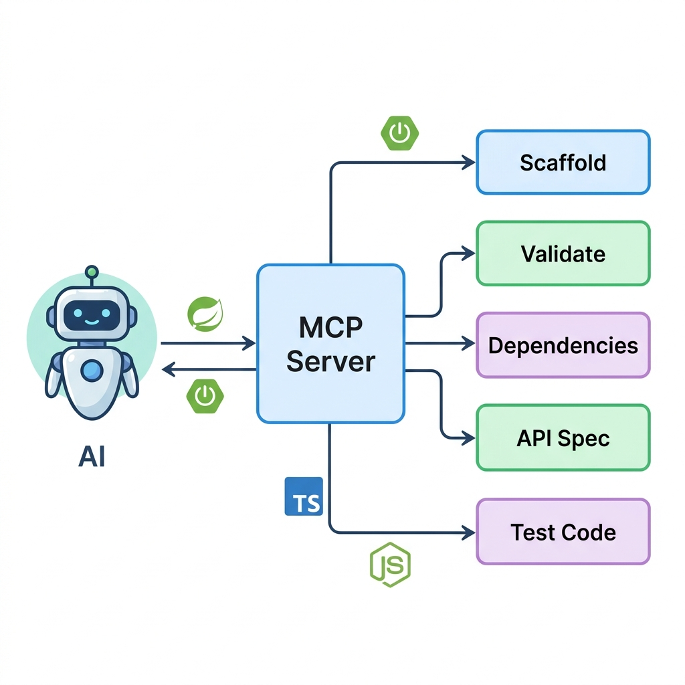

# DDD+MSA MCP Server



## 한국어

DDD+MSA MCP Server는 마이크로서비스 프로젝트를 위한 Streamable HTTP 기반 Model Context Protocol(MCP) 서버입니다.
기존 SSE 클라이언트와의 호환 엔드포인트도 함께 제공합니다.
DDD 스캐폴딩, 아키텍처 검증, 통신 스펙 생성, 서비스 의존성 분석, 테스트 스텁 생성을 지원합니다.

### 기능

#### 제공 MCP 도구

1. `inspect_workspace`
- 목적: 워크스페이스를 스캔해 언어, 빌드 도구, DDD 계층, 엔트리포인트, repository, 의존성 신호를 포함한 프로젝트 모델 생성
- 선택 인자: `targetPath` (기본값: 현재 워크스페이스)

2. `explain_architecture_violation`
- 목적: `validate_ddd_architecture` 또는 `analyze_service_dependencies`가 반환한 finding을 설명하고 영향/원인/선호 수정 방향을 제시
- 필수 인자: `finding`

3. `suggest_refactoring_plan`
- 목적: finding을 단계별 리팩터링 계획과 검증 체크리스트로 변환
- 필수 인자: `finding`
- 선택 인자: `targetPath`, `dryRun`

4. `scaffold_ddd_service`
- 목적: DDD 4계층 서비스 골격 생성
- 필수 인자: `serviceName`, `targetPath`
- 선택 인자: `language` (`typescript` | `spring` | `auto`), `basePackage`, `dryRun`, `overwrite`

5. `validate_ddd_architecture`
- 목적: 계층 간 잘못된 의존성(domain/application 위반) 탐지
- 필수 인자: `targetPath`
- 참고: 대상 경로의 `.dddmsa.json`이 있으면 사용자 정의 계층/룰을 적용합니다.

6. `generate_communication_spec`
- 목적: 핸들러/컨트롤러를 스캔해 API 스펙 생성
- 필수 인자: `sourcePath`, `outputFormat` (`openapi` | `grpc`)
- 선택 인자: `language`, `dryRun`, `overwrite`
- 참고: TypeScript 핸들러의 요청/응답 DTO 타입을 OpenAPI `components.schemas`로 변환하고, endpoint별 `x-source.file/line`을 포함합니다.
- 참고: Java/Spring mapping annotation도 가능한 경우 line 정보를 함께 기록합니다.

7. `analyze_service_dependencies`
- 목적: HTTP/Event/gRPC/인프라 의존성 추출 및 서비스 그래프 분석
- 필수 인자: `targetPath`
- 참고: `services/<service-name>` 또는 `apps/<app-name>` 구조에서 동일 DB 모델/리소스를 여러 서비스가 쓰면 `MSA-DB-SHARED`로 보고합니다.
- 참고: 서비스 간 동기/비동기 edge는 `DEP-GRAPH`로 반환하며, 순환 호출은 `DEP-GRAPH-CYCLE`, 높은 결합도는 `DEP-GRAPH-HOTSPOT`으로 보고합니다.
- 참고: 일부 파일 분석에 실패해도 전체 실행을 중단하지 않고 `DEP-ANALYSIS-WARN` 경고를 함께 반환합니다.

8. `generate_test_stub`
- 목적: 소스 파일 기준 테스트 스텁 생성
- 필수 인자: `targetFilePath`
- 선택 인자: `language` (`typescript` | `spring` | `auto`), `dryRun`, `overwrite`

### 요구 사항

- Node.js 20+
- npm 10+

### 설치 및 실행

```bash
git clone https://github.com/byeongjuPark/dddmsa-msa.git
cd dddmsa-msa
npm install
npm run build
npm run start
```

개발 모드:

```bash
npm run dev
```

기본 서버 URL:

- MCP Streamable HTTP 엔드포인트: `http://localhost:3001/mcp`
- 기존 HTTP+SSE 호환 엔드포인트: `GET http://localhost:3001/mcp`, `POST http://localhost:3001/mcp/messages?sessionId=...`
- 헬스 체크: `http://localhost:3001/health`

### 환경 변수

- `PORT`: HTTP 포트 (기본값: `3001`)
- `MCP_AUTH_TOKEN`: 인증 Bearer 토큰 (미설정 시 인증 비활성화)
- `MCP_ALLOWED_ORIGINS`: 허용 Origin 목록(쉼표 구분, 기본값: `http://localhost,http://127.0.0.1`)
- `RATE_LIMIT_MAX`: IP당 분당 최대 요청 수 (기본값: `100`)
- `WORKSPACE_ALLOWLIST`: 파일 작업 허용 절대 경로 목록(쉼표 구분)
- `LOG_LEVEL`: pino 로그 레벨 (기본값: `info`)
- `NODE_ENV=production`: pretty 로그 출력 비활성화

### 인증 및 보안

#### 인증 동작

- `GET /health`는 항상 공개됩니다.
- `MCP_AUTH_TOKEN`이 없으면 인증 없이 동작합니다.
- `MCP_AUTH_TOKEN`이 설정되면 `/health`를 제외한 모든 요청에
  `Authorization: Bearer <token>` 헤더가 필요합니다.

실패 응답:

- `401`: Authorization 헤더 누락/형식 오류
- `403`: 토큰 불일치

#### 요청 보호 장치

- 요청 본문 크기 제한: `1 MB` (`413 Payload Too Large`)
- Rate limit: IP당 분당 제한 (`429 Too Many Requests`)
- Origin 검증: `MCP_ALLOWED_ORIGINS`에 포함된 Origin만 허용
- `resolveSafePath`를 통한 path traversal/symlink escape 방지
- `WORKSPACE_ALLOWLIST` 설정 시 허용 경로 내부만 접근 허용

### MCP 사용 방법

#### 1) MCP 클라이언트 연결

MCP 기본 URL을 등록합니다.

```json
{
  "mcpServers": {
    "dddmsa-mcp": {
      "url": "http://localhost:3001/mcp"
    }
  }
}
```

인증 활성화 시 클라이언트 헤더에 다음을 포함합니다.

```http
Authorization: Bearer <MCP_AUTH_TOKEN>
```

참고:
- Streamable HTTP 클라이언트는 `/mcp`에 `POST`로 초기화하고 같은 URL로 후속 요청을 보냅니다.
- 기존 SSE 클라이언트는 세션 헤더 없이 `/mcp`에 `GET`으로 연결하고, 서버가 안내하는 `/mcp/messages?sessionId=...`로 메시지를 보냅니다.

#### 2) 코드 호출 예시 (MCP SDK)

```ts
import { Client } from "@modelcontextprotocol/sdk/client/index.js";
import { SSEClientTransport } from "@modelcontextprotocol/sdk/client/sse.js";

const client = new Client(
  { name: "example-client", version: "1.0.0" },
  { capabilities: {} }
);

const transport = new SSEClientTransport(new URL("http://127.0.0.1:3001/mcp"));
await client.connect(transport);

const tools = await client.listTools();
console.log(tools.tools.map(t => t.name));

const result = await client.callTool({
  name: "validate_ddd_architecture",
  arguments: { targetPath: "src" }
});

console.log(result);
await client.close();
```

#### 3) 도구 인자 예시

`inspect_workspace`

```json
{
  "targetPath": "services/order-service"
}
```

`scaffold_ddd_service`

```json
{
  "serviceName": "order-service",
  "targetPath": "services",
  "language": "spring",
  "basePackage": "com.example.order",
  "dryRun": true
}
```

`validate_ddd_architecture`

```json
{
  "targetPath": "services/order-service"
}
```

`suggest_refactoring_plan`

```json
{
  "finding": {
    "ruleId": "DDD-004",
    "confidence": 1,
    "evidence": [
      {
        "file": "presentation/orderController.ts",
        "message": "presentation layer violates disallowed infrastructure layer via ../infrastructure/sqlOrderRepository"
      }
    ],
    "errorCode": "DEPENDENCY_VIOLATION"
  },
  "targetPath": "services/order-service",
  "dryRun": true
}
```

`generate_communication_spec`

```json
{
  "sourcePath": "services/order-service/src",
  "outputFormat": "openapi",
  "dryRun": true
}
```

OpenAPI 생성 예시:

```json
{
  "paths": {
    "/orders": {
      "post": {
        "x-source": { "file": "routes.ts", "line": 15 },
        "requestBody": {
          "content": {
            "application/json": {
              "schema": { "$ref": "#/components/schemas/CreateOrderRequest" }
            }
          }
        },
        "responses": {
          "200": {
            "description": "OK",
            "content": {
              "application/json": {
                "schema": { "$ref": "#/components/schemas/OrderResponse" }
              }
            }
          }
        }
      }
    }
  }
}
```

`analyze_service_dependencies`

```json
{
  "targetPath": "services/order-service"
}
```

반환 예시:

```json
[
  {
    "ruleId": "DEP-GRAPH",
    "confidence": 1,
    "evidence": [
      {
        "file": "services/order-service/src/client.ts",
        "message": "order-service -> billing-service [sync-http]"
      }
    ],
    "recommendation": "Use this service graph to review runtime coupling, ownership boundaries, and integration style."
  },
  {
    "ruleId": "DEP-GRAPH-CYCLE",
    "confidence": 0.85,
    "evidence": [
      { "file": "services", "message": "Service cycle member: order-service" },
      { "file": "services", "message": "Service cycle member: billing-service" }
    ],
    "errorCode": "SERVICE_DEPENDENCY_CYCLE"
  }
]
```

`generate_test_stub`

```json
{
  "targetFilePath": "src/application/useCases/createOrder.ts",
  "language": "typescript",
  "dryRun": true
}
```

### 도구 결과 형식

대부분의 도구는 `content[0].text`에 JSON 배열 형태로 결과를 반환합니다.

```json
[
  {
    "ruleId": "EXAMPLE-RULE",
    "confidence": 1,
    "evidence": [
      { "file": "src/file.ts", "message": "..." }
    ],
    "recommendation": "optional",
    "errorCode": "optional"
  }
]
```

실패 시 MCP 응답에 `isError: true`가 포함됩니다.

### 아키텍처 룰 설정

서비스 루트에 `.dddmsa.json`을 두면 기본 DDD 룰 대신 프로젝트별 계층 이름과 금지 의존성을 설정할 수 있습니다.
기본 룰은 계층 역참조, 도메인 프레임워크 의존, presentation 계층의 repository 직접 접근, bounded context 간 entity import를 검사합니다.

```json
{
  "layers": {
    "domain": ["domain", "core"],
    "application": ["application", "usecases"],
    "infrastructure": ["infrastructure", "adapters"],
    "presentation": ["presentation", "api"]
  },
  "rules": [
    {
      "id": "DDD-001",
      "fromLayer": "domain",
      "disallowLayers": ["application", "infrastructure", "presentation"],
      "severity": "error",
      "recommendation": "도메인 모델은 프레임워크와 어댑터에 의존하지 않도록 분리하세요."
    },
    {
      "id": "DDD-003",
      "fromLayer": "domain",
      "disallowImports": ["org.springframework.*", "typeorm", "mongoose"],
      "severity": "error",
      "recommendation": "도메인 모델은 프레임워크와 영속성 기술에 의존하지 않도록 분리하세요."
    }
  ],
  "ignorePaths": ["node_modules", "dist", "build", ".git"]
}
```

### 테스트

```bash
npm test
```

Vitest는 `threads` pool(`vitest run --pool=threads`)로 실행됩니다.

### 트러블슈팅

- `401 Missing or invalid Authorization header`
  - `Authorization: Bearer <token>` 형식 확인
- `403 Forbidden: Invalid token`
  - 클라이언트 토큰과 `MCP_AUTH_TOKEN` 일치 여부 확인
- `404 Session not found or inactive`
  - `/mcp`로 재연결 후 재시도
- `Security Violation: Path traversal detected`
  - 워크스페이스(및 allowlist) 내부 경로만 사용

